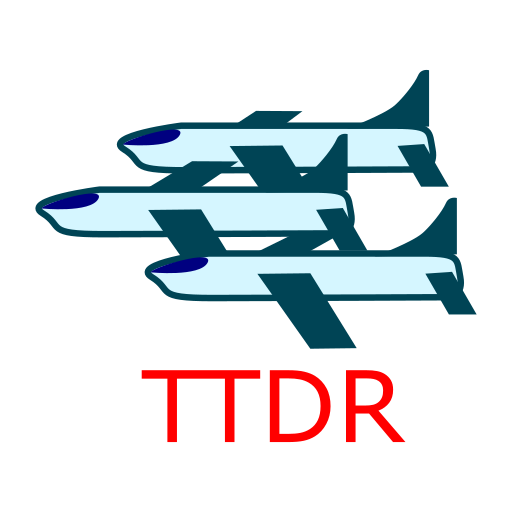

# SANDSAIL
First, the units following Maverick will get to him in a line formation. Then, the Maverick will move in the direction of the wind & the other units will follow him in a line formation. Sometimes, the direction gets a bit tricky (looks like some angle has to be changed sometimes, depending on current movement wind angle).

## Credit
```GetMaverickGroup``` is a slightly modified version of Lukáš Hofman's (```nota_luhi_firstai```) script (we were collaborating during development & before we both published our repos, so each of us is using a slightly different version, but I left his name as the author in the script file because he invented most of it :D ). Also, most of the sensors. Other referentions/inspirations are also included in the lua script headers.

# TTDR

## How to use
1) Select all units
2) Select the TTDR action 

**! IMPORTANT NOTE !** Turn off the debugging widget *dbg_exampleDrawLines* before executing - some of the *nota_michelle_intro* commands use it for debugging very exceedingly, to the point it may cause memory crashes.

## How it works
First, all the peepers are going to sweep around the map. After that, a map of safe paths is created (using *nota_michelle_intro* sensors and commands). After that, the atlases start rescuing units, using the map of safe paths. As an optimization, points on a straight (safe enough) path are truncated. Also, diagonal movement is supported as well, and the atlases now don't need to fly away from the deployment point (they just stay in the air now). To better check if an atlas can choose a direct path to the rescued unit, an XXYY box is checked for enemy unit presence (compared to values in custom map of information about spotted enemies - **press Ctrl+Shift+M to visualize**).